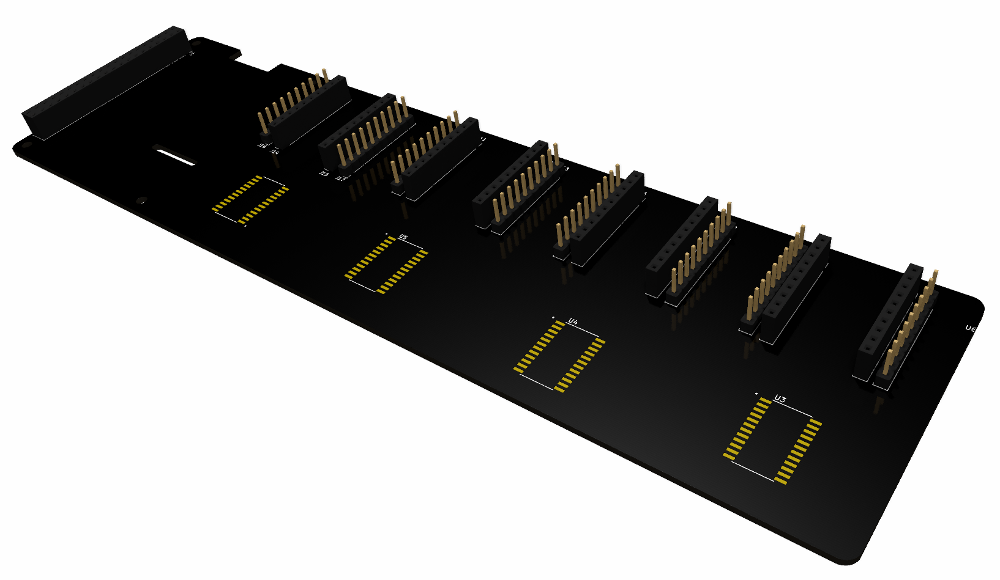
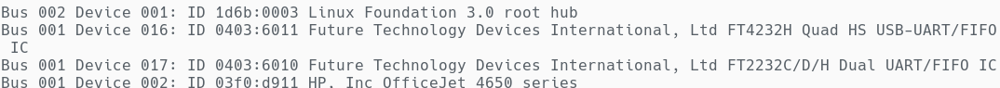
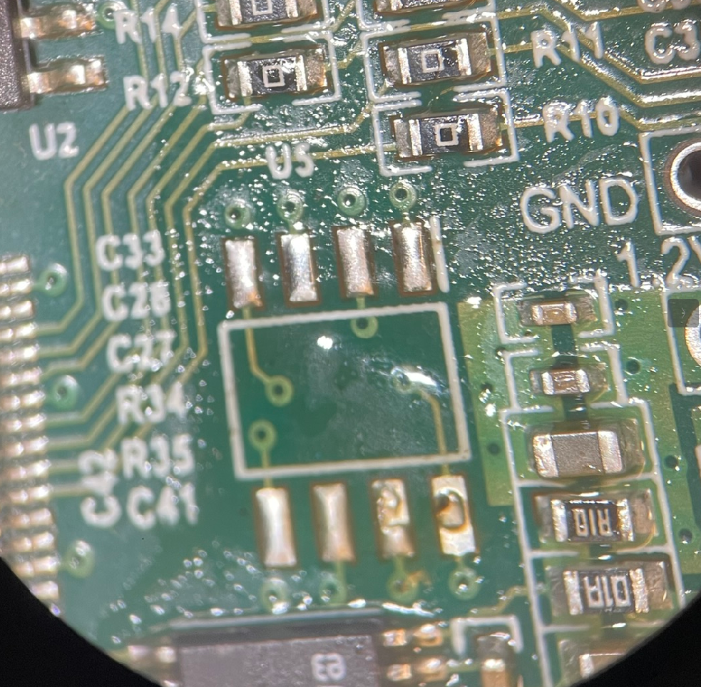
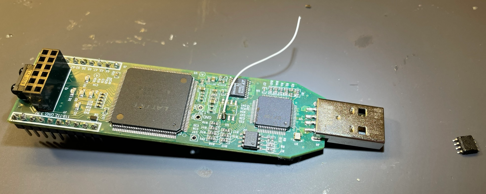
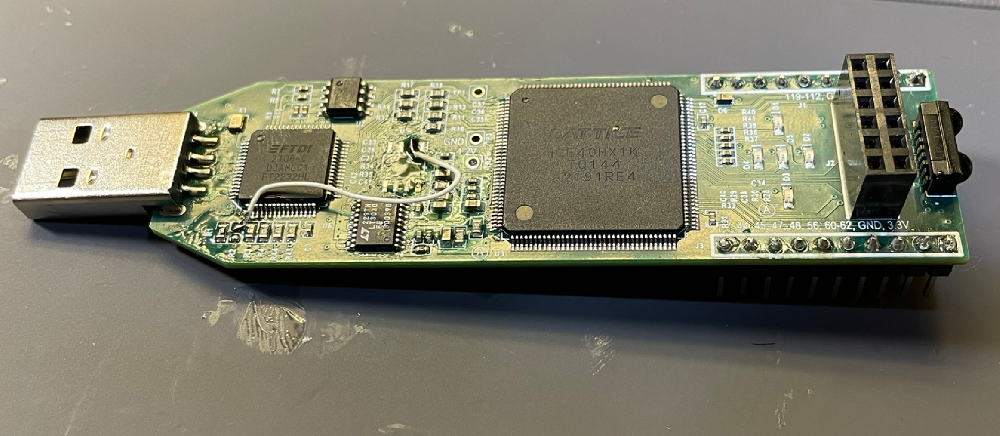
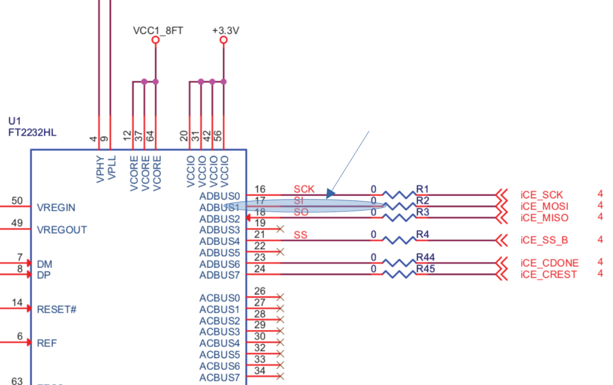

# Raspberry Pi Carrier Board

|  | 
|:--:| 
| *PCB Render* |

**NOTE THIS IS A WORK IN PROGRESS**

## Overview
This is the current progress on the latest version of a data carrier board for the evolutionary hardware project.

## Features
Support for raspberry pi as the main computer, support for up to 4 FPGAs on board, 5 M samples per second per channel on the ADC, analog multiplexing is used to connect each one of the connections on the FPGA to the ADC. 

## Setup Guide
Here is a setup guide explaining the process of connecting the FPGAs to the hardware. More info will be coming for setting up the software stack to work on here

### Connecting Raspberry Pi

### Adjusting the PID for each FPGA
When connecting multiple dev boards to a system it is useful to have different USB PID numbers on each board so that way the system can tell them apart. This can be set using the following utility from FTDI called FT_PROG.

[Link to FT_PROG](https://ftdichip.com/utilities/)

|  | 
|:--:| 
| *Example Changed PIDs* |

### (Optional) Bypass the SRAM
As mentioned inside of the project Ice Storm while uploading a program to an FPGA there is a way to bypass the SRAM module. This requires a simple hardware modification as outlined below. 

1. **Removing the SRAM Module**
   Given we are going to be bypassing the SRAM module this can be removed. On the PCB this is labeled as U5

|  | 
|:--:| 
| *Removed SRAM Module* |

2. **Removing the 0 Ohm Resistor** 
   Once the SRAM module is removed we can remove the 0 Ohm resistor labeled as R2 which connects between the SRAM module and the programer chip

|  | 
|:--:| 
| *Removed 0 Ohm Resistor* |

   
3. **Connecting the SRAM Footprint**
   Next we can connect one end of our jumper wire (in this picture I am using 30 gauge wire) to the SRAM footprint. 

|  | 
|:--:| 
| *Connecting Jumper to SRAM Module* |

4. **Jumping to the 0 Ohm Resistor**
   Finally we can connect the jumper to the pad from the 0 ohm resisor as seen in the pictures below
   
|  | 
|:--:| 
| *Connected Jumper* |

|  | 
|:--:| 
| *Schematic Reference* |

## BOM

### Muxes
16 Channel 24-SOIC Package
https://www.digikey.com/en/products/detail/texas-instruments/CD74HC4067M96/1507236

### Analog to Digital Convertor
